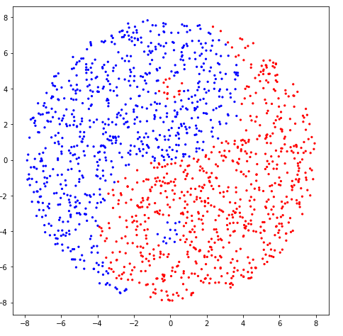

## Generate datasets for machine learning classification tasks, the Tao way.

#### Introduction and Motivation

    data, labels = yin_yang_datagen(n = 3000, num_target_classes = 3)

As learners and practitioners of data science, we seek to understand the underlying workings of complex, "black box" algorithms. There is no better way to understand the optimization methods employed by the algorithm to fit a training dataset than by visualizing the progress of the fit over time (training epochs). For certain datasets, we also want to understand just <i>which</i> classification methods perform better than others and why. The `yin_yang_dataset` generates datasets of shape `(m, 2)`, with `m` being the desired size, and corresponding target values for use by classification algorithms.

    data.shape = (3000,2)
    labels.shape = (3000,)

#### Basic Usage

    from yin_yang import yin_yang_datagen
    data, labels = yin_yang_datagen(n = 1500, size_ratio = 0.18, num_target_classes = 2)
    
    def cmapper(x):
        if x == 1:
            return 'red'
        if x == -1:
            return 'blue'
        if x == 0:
            return 'orange'
    
    plt.figure(figsize=(8, 8))
    plt.scatter(data[:, 0], data[:, 1], s = 5, c = list(map(cmapper, labels)))

    
Linear classifiers such as logistic regression can do no better than fit a line through the 2-D space. It is inherently impossible for a linear classifier to capture the <i>yin</i> in the <i>yang</i>, or the <i>yang</i> in the <i>yin</i>. The sample space thus becomes a playground for the host of non-linear algorithms that can best solve the problem. Fundamentally, how does the sample space and the associated labels influence the choice of the "best-fit" algorithms?

By varying the `size_ratio` parameter, the size of the small `yin` and `yang` "islands" can be controlled, ergo controlling the complexity of the dataset (small values of `size_ratio` make very small islands, while high values can result in constricted "straits"). A `size_ratio` greater than 0.1 is recommended for small datasets (`n` < 4000).

#### Attributes

`yin_yang_datagen(n = 1000, num_target_classes = 2, balanced = 1, size_ratio = 0.25)`

(1) `n` : int; the number of data points required to be generated; default = 1000

(2) `num_target_classes` : int; value either 2 and 3; default = 2

(3) `balanced` : boolean; available only for binary target datasets; default = True

(4) `size_ratio` : float; value between 0 and 1; this controls complexity of the dataset. default = 0.25
